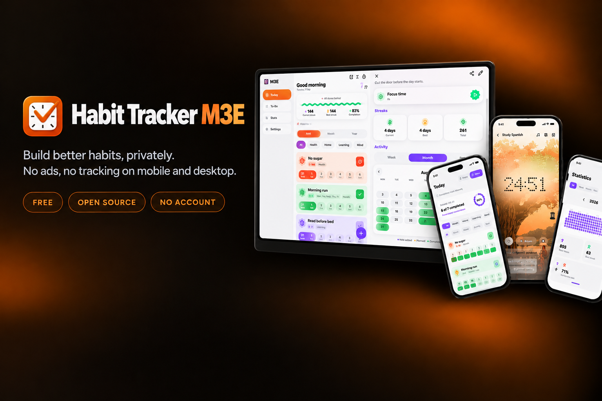
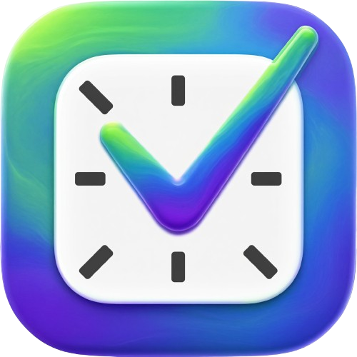
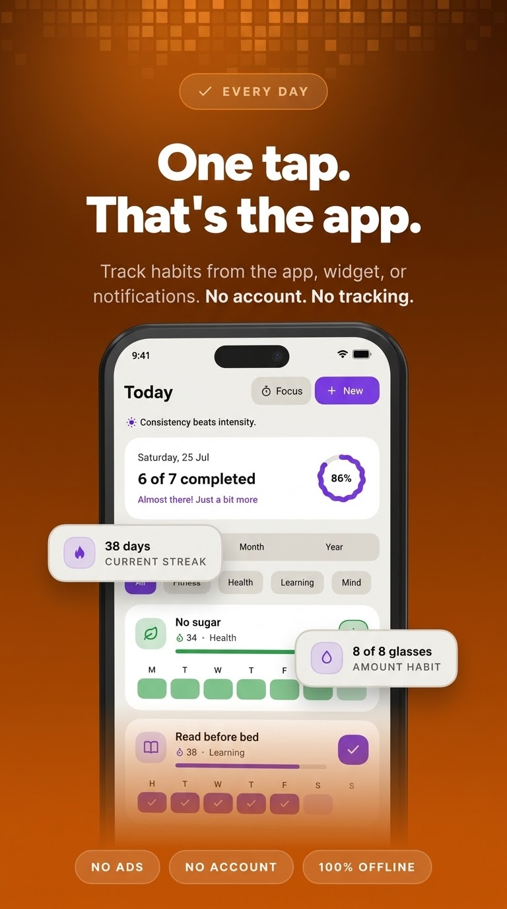
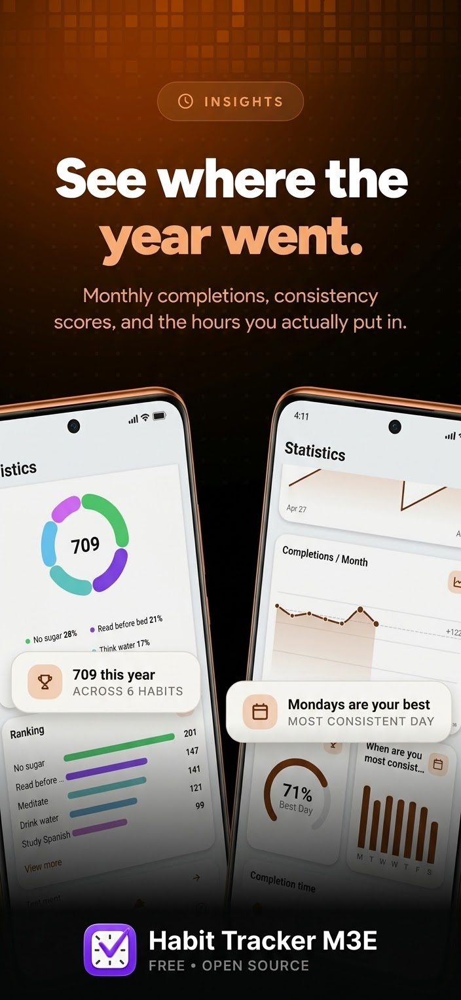
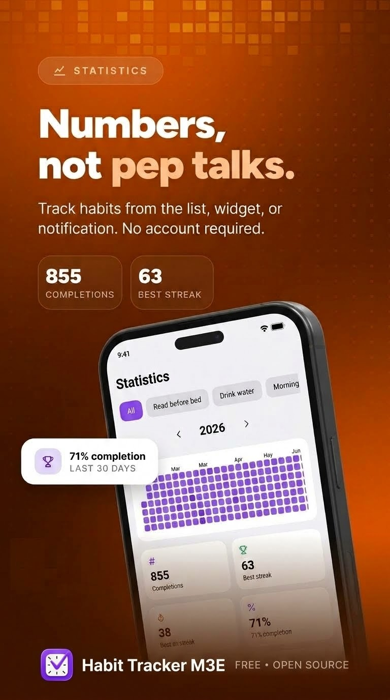
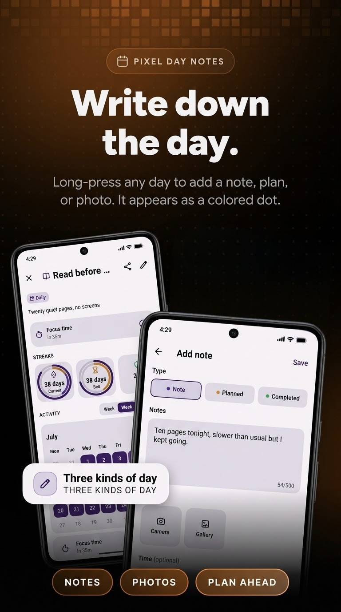
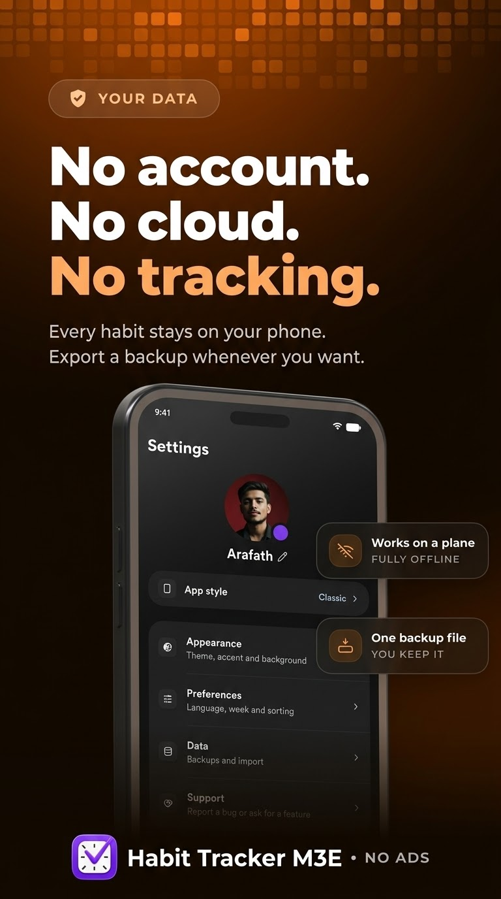
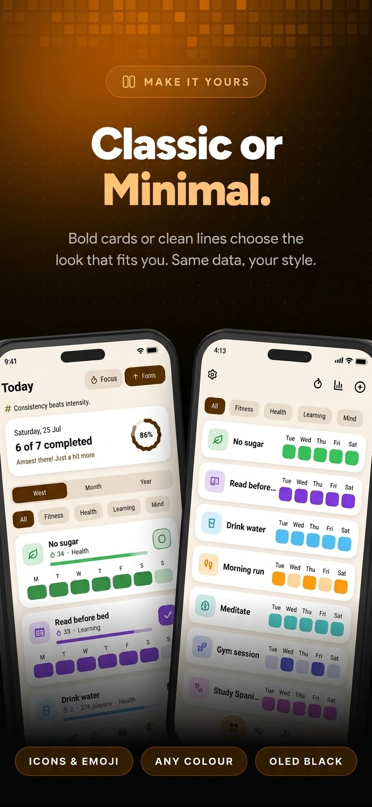

---

  <b>English</b> · <a href="docs/README.es.md">Español</a> · <a href="docs/README.zh-CN.md">中文</a> · <a href="docs/README.ru.md">Русский</a>

### Habit Tracker M3E

  &nbsp;&nbsp;
  &nbsp;&nbsp;
  &nbsp;&nbsp;
  

### A minimal, private, ad-free habit tracker

Log a habit in a single tap, keep your momentum, and watch your streaks grow.

 

  
  
  
  
  
  

 

  <a href="#features">Features</a> ·
  <a href="#coming-from-another-app">Import</a> ·
  <a href="#download">Download</a> ·
  <a href="#privacy">Privacy</a> ·
  <a href="#translations">Translations</a> ·
  <a href="#support">Support</a>

---

<b>Today</b> · <b>Focus</b> · <b>Statistics</b> · <b>Insights</b> · <b>Amounts</b> · <b>Notes</b> · <b>Personalize</b> · <b>Free &amp; private</b>

---

## Overview

Habit Tracker M3E is an open source habit tracker for Android, Windows and Linux. Make as
many habits as you want, log them with one tap, and watch the grid, the streak
counters and the statistics fill up.

Everything stays on your device. No account, no ads, nothing to sync.

---

## Features

<table>
<tr>
<td width="50%" valign="top">

### Tracking

- One-tap logging from the home screen, a widget or the notification
- Three kinds of habit: **normal**, **avoid** (with relapses) and **amount**,
  with your unit and daily goal
- **Checklists** split a habit into steps, done when all are checked
- **Flexible schedules**: daily, X times a week or month, chosen weekdays, or
  every N days
- **Fill in the past**: tap any day to add or remove it
- **Day notes**: long-press a day to write what happened, or attach a photo
- **Vacation mode** pauses a habit without breaking anything

</td>
<td width="50%" valign="top">

### Seeing your progress

- GitHub-style **activity grid**, by week, month or the whole year
- **Month calendar**, with your week starting on Monday, Saturday or Sunday
- **Completions per month**, so you can see the shape of a whole year
- **Streak evolution** charted over time, watching the line climb
- **"When are you most consistent?"** finds the hours you actually show up
- Totals, best and current streak, completion rate and a per-habit
  **strength** score
- A **shareable progress card** in several sizes, exported as a polished image

</td>
</tr>
<tr>
<td width="50%" valign="top">

### Focus sessions

- A timer for the habits that need one, free or tied to a habit and its goal
- **Pomodoro rounds** with short breaks, or one long stretch
- Three clock styles: **Circle**, **Flip** and **Dots**
- Built-in sounds (rain, brown noise, fire) or your own tracks, in order
  or shuffled
- Calm scenes as a background, or a photo of your own
- Tick off subtasks without leaving the timer, and keep the screen awake
- A **daily focus goal**, plus a history of every session you finish

</td>
<td width="50%" valign="top">

### Making it yours

- **Classic, Minimal or Express**: three complete designs, each with its own
  typography, shapes and motion
- Minimalist icon pack, or any emoji you like
- Custom accent color with a full picker
- Light and dark themes, plus five app backgrounds: solid, gradient, dots,
  true-black OLED or a photo of your own
- Cover photos, categories, drag-to-reorder, profile name and photo
- Three launcher icons, so Habit Tracker M3E matches the rest of your home screen
- A burst of confetti the day you finish everything

</td>
</tr>
<tr>
<td width="50%" valign="top">

### Reminders and widgets

- Reminders per habit, on the days you choose or every N days, each with a
  short encouraging line
- **Done**, **Snooze** and **Add amount** buttons right in the notification
- **Four home-screen widgets**: habit, today, stats and activity grid
- Each widget styled on its own, with color or photo, opacity and border
- Choose which figures the **stats widget** shows, and how they sit together
- Tick a day straight from a widget, it saves without opening the app
- Tap the activity grid to jump into that habit

</td>
<td width="50%" valign="top">

### Your data

- **Import** from Loop Habit Tracker, HabitKit, Habitica and HabitBull,
  history and streaks included, or any CSV with a habit and a date
- Backup and restore with a single file you keep yourself
- **Automatic backups**, daily or weekly, to a folder of your choosing
- **App lock** with a PIN or your fingerprint, for phones without one
- **Archive** habits without losing a day of their history
- Everything is offline: no account, no server, nothing to sync
- Seven languages, with more open on Weblate

</td>
</tr>
</table>

---

## Coming from another app?

<b>How the import works</b>

Bring your history with you. Habit Tracker M3E reads exports from **Loop Habit Tracker**,
**HabitKit**, **Habitica** and **HabitBull**, so your past days and your streaks
survive the move. Any other CSV works too, as long as it has a habit and a date.

<b>Settings → Data → Import from another app</b>

---

## Download

Download Habit Tracker M3E directly from [**GitHub Releases**](https://github.com/smartworldarafath/Habit-Tracker-M3E/releases).

Habit Tracker M3E runs on Android, Windows, Linux, and iOS (iPhone & iPad):

| Platform | Status |
|----------|--------|
| &nbsp;&nbsp;**Android** | ✅ **Supported** |
| &nbsp;&nbsp;**Windows** | ✅ **Supported** |
| &nbsp;&nbsp;**Linux** | ✅ **Supported** |
| <picture><source media="(prefers-color-scheme: dark)" srcset="https://upload.wikimedia.org/wikipedia/commons/3/31/Apple_logo_white.svg" /></picture>&nbsp;&nbsp;**iOS (iPhone & iPad)** | ✅ **Supported** |
| &nbsp;&nbsp;**macOS** | 📅 **Planned** |

<b>Linux</b>

Two files on the [**Releases**](https://github.com/smartworldarafath/Habit-Tracker-M3E/releases) page,
both for 64-bit x86:

| File | For |
|------|-----|
| `HabitTrackerM3E-x86_64.AppImage` | Any distribution: make it executable and run it |
| `HabitTrackerM3E-linux-x64.tar.gz` | Unpack anywhere and run `HabitTrackerM3E` |

The Linux build has only just landed, so expect some rough edges. Reminders ring
while Habit Tracker M3E is open. If something does not work, open an issue and I will fix
them as they come.

<b>Install the APK yourself</b>

Prefer the raw APK? It's on the
[**Releases**](https://github.com/smartworldarafath/Habit-Tracker-M3E/releases) page, one file per
phone type so each download stays small:

| APK | For |
|-----|-----|
| `HabitTracker-arm64-v8a.apk` | Modern 64-bit phones, **pick this one** |
| `HabitTracker-armeabi-v7a.apk` | Older 32-bit devices |
| `HabitTracker-x86_64.apk` | Emulators and x86 tablets |

Runs on **Android 9 (Pie) and newer**.

If you install the APK yourself, [**Obtainium**](https://github.com/ImranR98/Obtainium)
keeps it updated: add `https://github.com/smartworldarafath/Habit-Tracker-M3E` and it will follow the
Releases page, tell you when a new version is out and pick the right APK for
your phone.

> [!NOTE]
>Habit Tracker M3E isn't on the Play Store. Since the APK doesn't come from a store,
>Android may ask you to allow installs from your browser or file manager the
>first time.

---

## Privacy

> [!IMPORTANT]
>Habit Tracker M3E **never connects to the internet**, and that is a core rule, not a
>setting. On Android it does not even ask for the internet permission. There
>are no analytics, no ads, no accounts and no servers: your data never leaves
>your device. If you want a copy somewhere else, such as a cloud drive, you
>export it and put it there yourself. Links you tap open in your browser.

---

## Translations

Translations are managed on [**Weblate**](https://hosted.weblate.org/engage/streak/):
no coding needed, just short phrases you translate in your browser. New
languages are welcome.

How it works → [**TRANSLATING.md**](TRANSLATING.md)

---

## Contributing

Bug reports, ideas and pull requests are all welcome, see
[**CONTRIBUTING.md**](CONTRIBUTING.md). For anything larger than a fix, open an
issue first so we can agree on the direction.

---

## Inspiration

<b>The apps that shaped Habit Tracker M3E</b>

These are the apps Habit Tracker M3E learned from:

- **[Loop Habit Tracker](https://github.com/iSoron/uhabits)**, for proving a
  habit tracker can be free, offline and still excellent.
- **[Grit](https://github.com/shub39/Grit)**, for the small motions that make a
  list feel alive.
- **[HabitKit](https://www.habitkit.app/)**, for how good a year of history
  looks as a coloured grid.
- **[Habitica](https://github.com/habitRPG/habitica)**, for treating showing up
  as something worth celebrating.

The island you build in the gamification tab is drawn with
**[Mykonos Island Voxels](https://github.com/boona13/mykonos-island-voxels)** by
boona13, an MIT licensed set of isometric voxel art. Thank you for putting it
out there for anyone to use.

The streak flame on the home screen widgets is the fire from
**[Fluent Emoji](https://github.com/microsoft/fluentui-emoji)** by Microsoft,
released under the MIT license.

---

## Support

Habit Tracker M3E is free, open source and free of ads, and it stays that way.

If you want to give something back, a star, a translation or a clear bug report
help as much as a coffee does.

 
 

<a href="https://www.star-history.com/#smartworldarafath/Habit-Tracker-M3E&Date">
 <picture>
   <source media="(prefers-color-scheme: dark)" srcset="https://api.star-history.com/svg?repos=smartworldarafath/Habit-Tracker-M3E&type=Date&theme=dark" />
   <source media="(prefers-color-scheme: light)" srcset="https://api.star-history.com/svg?repos=smartworldarafath/Habit-Tracker-M3E&type=Date" />
   
 </picture>
</a>

 
 

Released under the <a href="LICENSE"><b>GNU GPLv3</b></a>, with the <a href="ADDITIONAL_TERMS.md">attribution term</a> of its section 7(b).

