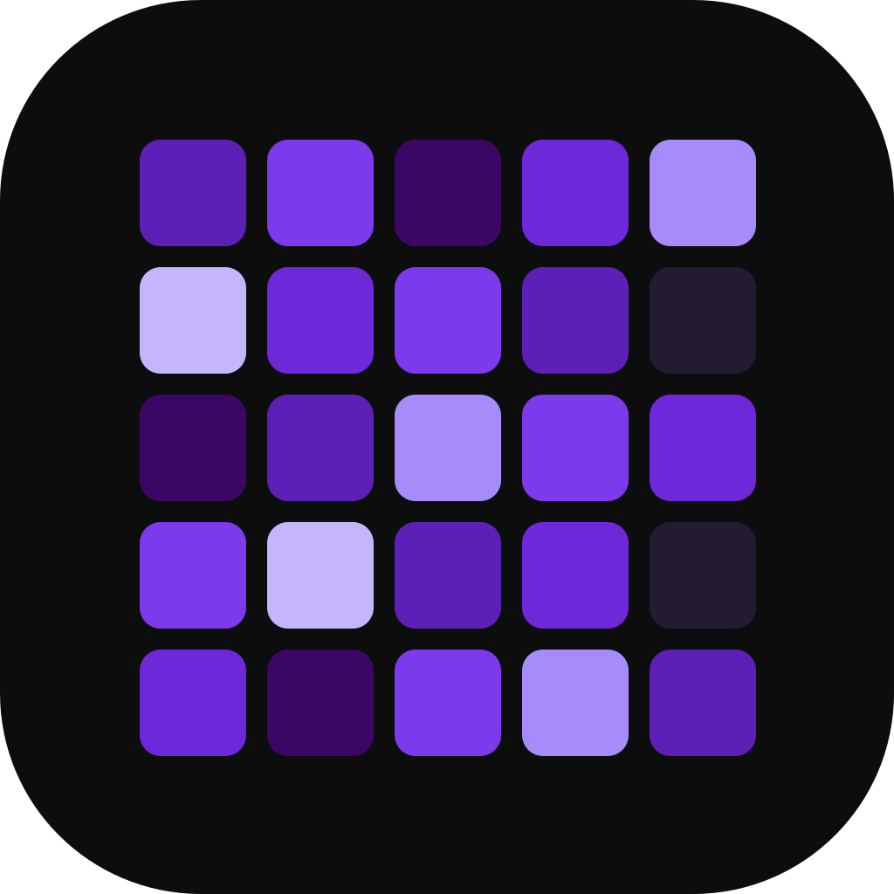
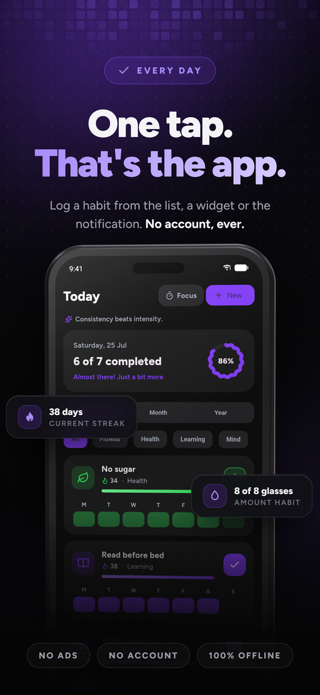
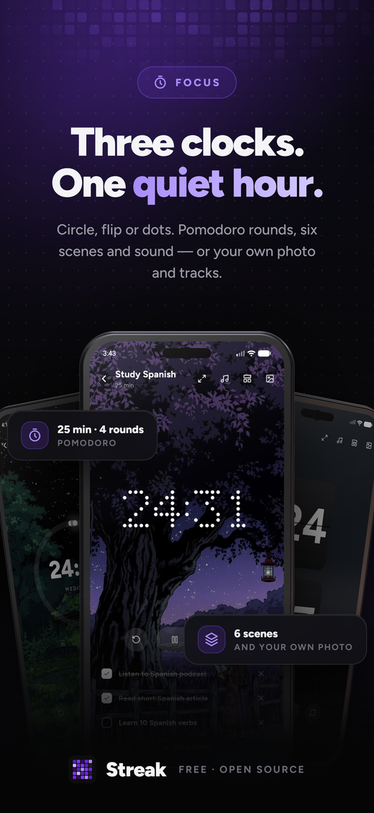
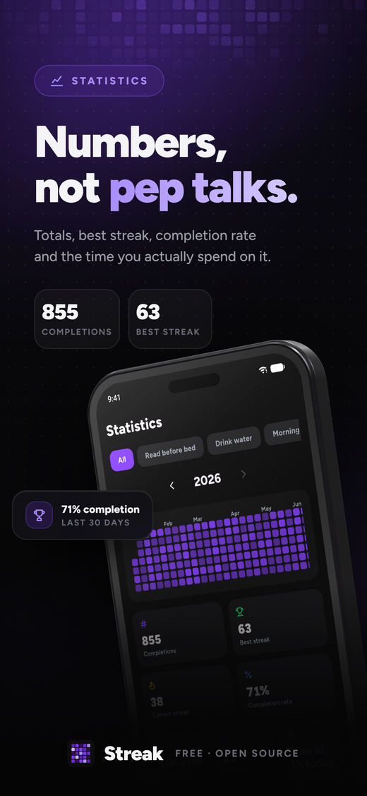
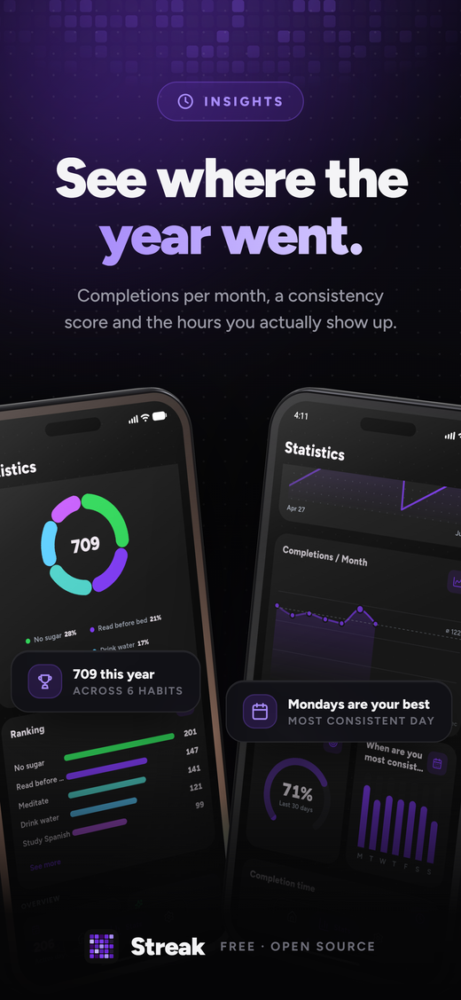
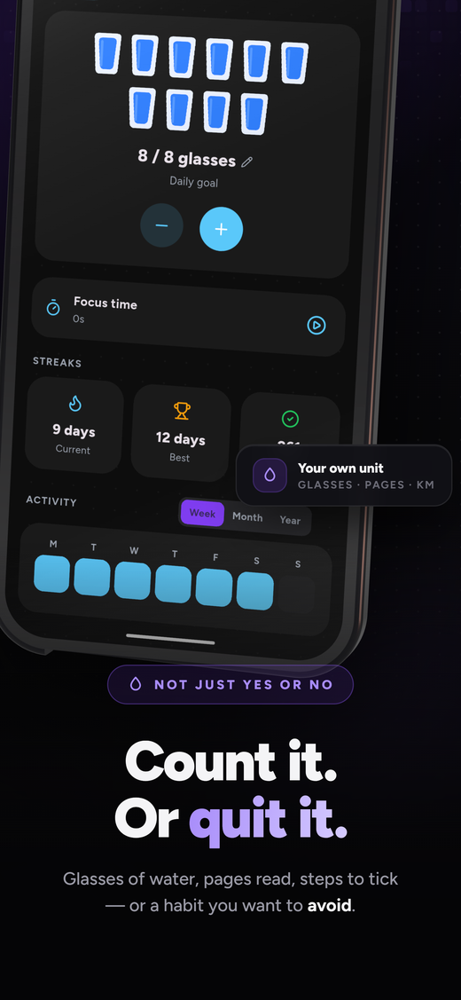
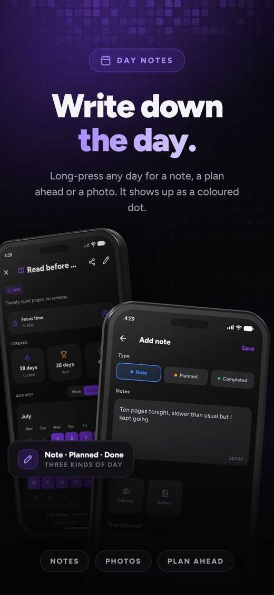
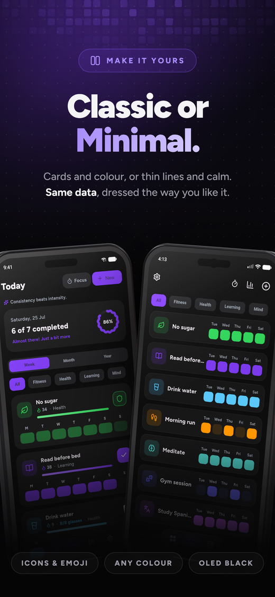
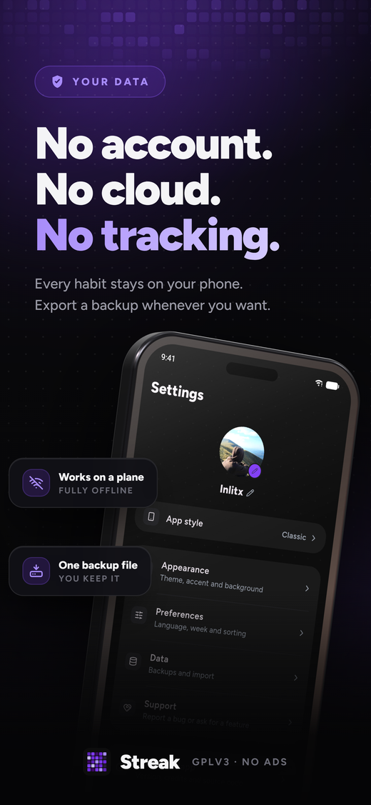

---

  <a href="../README.md">English</a> · <a href="README.es.md">Español</a> · <a href="README.zh-CN.md">中文</a> · <b>Русский</b>

### Habit Tracker M3E

### Минималистичный, приватный трекер привычек без рекламы

Отмечайте привычку одним касанием, сохраняйте темп и наблюдайте, как растут ваши серии.

 

  
  
  
  
  

 

 

  <a href="#возможности">Возможности</a> ·
  <a href="#переходите-с-другого-приложения">Импорт</a> ·
  <a href="#скачать">Скачать</a> ·
  <a href="#конфиденциальность">Конфиденциальность</a> ·
  <a href="#переводы">Переводы</a> ·
  <a href="#поддержка">Поддержка</a>

---

<b>Сегодня</b> · <b>Фокус</b> · <b>Статистика</b> · <b>Аналитика</b> · <b>Количество</b> · <b>Заметки</b> · <b>Персонализация</b> · <b>Бесплатно и приватно</b>

---

## Обзор

Habit Tracker M3E: трекер привычек с открытым исходным кодом для Android, который уважает
вас. Создавайте сколько угодно привычек, отмечайте их одним касанием и наблюдайте,
как растёт прогресс в сетке активности в стиле GitHub, счётчиках серий и на панели
статистики.

Приложение быстрое, работает офлайн и создано для спокойствия, а не давления.

---

## Возможности

<table>

### Отслеживание

- Отметка одним касанием с главного экрана, из виджета или из уведомления
- Три типа привычек: **обычная**, **избегать** (со срывами) и **количество**,
  со своей единицей и целью
- **Чек-листы** разбивают привычку на шаги: засчитывается, когда отмечены все
- **Гибкое расписание**: ежедневно, X раз в неделю или месяц, выбранные дни
  недели или каждые N дней
- **Заполнение прошлого**: нажмите на любой день, чтобы поставить отметку
- **Заметки к дню**: долгое нажатие, чтобы записать день или добавить фото
- **Режим отпуска** ставит привычку на паузу, ничего не ломая

</td>

### Просмотр прогресса

- **Сетка активности** в стиле GitHub: неделя, месяц или целый год
- **Календарь месяца**: неделя начинается с понедельника, субботы или
  воскресенья, как вам удобно
- **Выполнения по месяцам**, чтобы увидеть форму целого года
- **Динамика серии** на графике: наблюдайте, как растёт линия
- **«Когда вы наиболее последовательны?»** находит часы, в которые вы
  справляетесь
- Итоги, лучшая и текущая серия, процент выполнения и показатель **силы**
  привычки
- **Карточка прогресса** для публикации в нескольких размерах, готовым
  изображением

</td>
</tr>

### Сессии фокусировки

- Таймер для привычек, которым он нужен: свободный или привязанный к привычке
  и её цели
- **Раунды помодоро** с короткими перерывами или один длинный отрезок
- Три стиля циферблата: **Круг**, **Флип** и **Точки**
- Встроенные звуки (дождь, коричневый шум, огонь) или свои треки, по
  порядку или вперемешку
- Спокойные сцены на фоне или собственное фото
- Отмечайте подзадачи, не выходя из таймера, и держите экран включённым
- **Дневная цель фокусировки**, а также история всех завершённых сессий

</td>

### Настройка под себя

- **Классический, Минимальный или Express**: три полноценных дизайна, каждый со
  сетка из четырёх разделов
- Минималистичный набор значков или любой эмодзи
- Свой акцентный цвет с полным выбором палитры
- Светлая и тёмная темы, а также пять фонов: сплошной, градиент, точки, чёрный
  OLED или своё фото
- Обложки, категории, изменение порядка перетаскиванием, имя и фото профиля
- Три значка приложения, чтобы Habit Tracker M3E сочетался с остальным главным экраном
- Взрыв конфетти в день, когда выполнено всё

</td>
</tr>

### Напоминания и виджеты

- Напоминания для каждой привычки в выбранные дни или каждые N дней, с
  короткой ободряющей фразой
- Кнопки **«Готово»**, **«Отложить»** и **«Добавить количество»** прямо в
  уведомлении
- **Четыре виджета на главном экране**: привычка, сегодня, статистика и сетка
  активности
- У каждого виджета свой стиль: цвет или фото, прозрачность и рамка
- Выберите, какие показатели отображает **виджет статистики** и как они
  расположены
- Отмечайте день прямо с виджета, он сохраняется без открытия приложения
- Нажмите на сетку активности, чтобы перейти к этой привычке

</td>

### Ваши данные

- **Импорт** из Loop Habit Tracker, HabitKit, Habitica и HabitBull вместе с
  историей и сериями или из любого CSV с привычкой и датой
- Резервное копирование и восстановление одним файлом, который храните вы сами
- **Автоматические копии**, ежедневно или еженедельно, в выбранную вами папку
- **Блокировка приложения** по PIN-коду или отпечатку пальца
- **Архивируйте** привычки, не теряя их историю
- Всё работает офлайн: без аккаунта, без сервера, нечего синхронизировать
- Семь языков, ещё больше открыто на Weblate

</td>
</tr>
</table>

---

## Переходите с другого приложения?

<b>Как работает импорт</b>

Перенесите свою историю с собой. Habit Tracker M3E читает экспорт из **Loop Habit Tracker**,
**HabitKit**, **Habitica** и **HabitBull**, поэтому прошедшие дни и серии
переживают переезд. Подойдёт и любой другой CSV, если в нём есть привычка
и дата.

<b>Настройки → Данные → Импорт из другого приложения</b>

---

## Скачать

способ: устанавливает Habit Tracker M3E и поддерживает его в актуальном состоянии.
Также доступно на

Сейчас Habit Tracker M3E это приложение для Android, остальные платформы уже в работе:

| Платформа | Статус |
|-----------|--------|
| Android | ✅ Поддерживается |
| Windows | ✅ Поддерживается |
| Linux | ✅ Поддерживается |
| iOS | 🚧 В работе |
| macOS | 📅 Запланировано |

<b>Linux</b>

Два файла на странице [**Releases**](https://github.com/smartworldarafath/Habit-Tracker-M3E/releases),
оба для x86 64 бит:

| Файл | Для чего |
|------|----------|
| `HabitTrackerM3E-x86_64.AppImage` | Любой дистрибутив: сделайте файл исполняемым и запустите |
| `HabitTrackerM3E-linux-x64.tar.gz` | Распакуйте куда угодно и запустите `Habit Tracker M3E` |

Сборка для Linux вышла совсем недавно, поэтому ошибки возможны. Напоминания
работают, пока Habit Tracker M3E открыт. Если что-то не работает, откройте issue, и я всё
исправлю.

<b>Установить APK вручную</b>

Предпочитаете обычный APK? Он на странице
[**Releases**](https://github.com/smartworldarafath/Habit-Tracker-M3E/releases), по одному файлу на
тип телефона, чтобы каждая загрузка была небольшой:

| APK | Для |
|-----|-----|
| `HabitTrackerM3E-arm64-v8a.apk` | Современные 64-битные телефоны, **выберите этот** |
| `HabitTrackerM3E-armeabi-v7a.apk` | Старые 32-битные устройства |
| `HabitTrackerM3E-x86_64.apk` | Эмуляторы и планшеты x86 |

Работает на **Android 9 (Pie) и новее**.

Если вы устанавливаете APK вручную, [**Obtainium**](https://github.com/ImranR98/Obtainium)
будет держать его в актуальном состоянии: добавьте
`https://github.com/smartworldarafath/Habit-Tracker-M3E`, и он будет следить за страницей Releases,
сообщит о новой версии и выберет подходящий APK для вашего телефона.

> [!NOTE]
>Habit Tracker M3E отсутствует в Play Store. Поскольку APK не из магазина, при первой
>установке Android может попросить разрешить установку из вашего браузера
>или файлового менеджера.

---

## Конфиденциальность

> [!IMPORTANT]
>Habit Tracker M3E **никогда не подключается к интернету**, и это основное правило, а не
>настройка. На Android приложение даже не запрашивает доступ к интернету. Нет
>аналитики, рекламы, аккаунтов и серверов: ваши данные никогда не покидают
>устройство. Если нужна копия в другом месте, например в облаке, вы
>экспортируете её и загружаете сами. Ссылки открываются в вашем браузере.

---

## Переводы

Переводы ведутся на [**Weblate**](https://hosted.weblate.org/engage/streak/):
программировать не нужно, только короткие фразы, которые вы переводите в
браузере. Новые языки приветствуются.

Как это работает → [**TRANSLATING.md**](../TRANSLATING.md)

---

## Вклад в проект

Сообщения об ошибках, идеи и pull request'ы приветствуются, см.
[**CONTRIBUTING.md**](../CONTRIBUTING.md). Для чего-то большего, чем небольшое
исправление, сначала откройте issue, чтобы согласовать направление.

---

## Вдохновение

<b>Приложения, которые повлияли на Habit Tracker M3E</b>

Habit Tracker M3E появился не на пустом месте. Вот приложения, которые на него повлияли:

- **[Loop Habit Tracker](https://github.com/iSoron/uhabits)**, за доказательство
  того, что трекер привычек может быть свободным, офлайновым и тихо отличным.
- **[Grit](https://github.com/shub39/Grit)**, за отделку: мелкие движения и
  ощущение, что список живой.
- **[HabitKit](https://www.habitkit.app/)**, за то, как хорошо выглядит год
  истории в виде цветной сетки.
- **[Habitica](https://github.com/habitRPG/habitica)**, за отношение к каждому выполненному дню
  как к поводу для праздника.

Остров, который вы строите на вкладке геймификации, нарисован с помощью
**[Mykonos Island Voxels](https://github.com/boona13/mykonos-island-voxels)** от
boona13, набора изометрической воксельной графики под лицензией MIT. Спасибо,
что выложили его для всех.

Здесь нет ничего скопированного у них. Их идеи были отправной точкой, а дальше
Habit Tracker M3E пошёл своим путём.

---

## Поддержка

Habit Tracker M3E бесплатен, с открытым кодом и без рекламы, так и останется.

В этом форке нет ссылки на пожертвование. Если хочется что-то вернуть, звезда,
перевод или понятный отчёт об ошибке помогают не меньше всего остального.

 
 

Распространяется по лицензии <a href="../LICENSE"><b>GNU GPLv3</b></a> с <a href="../ADDITIONAL_TERMS.md">условием атрибуции</a> из её раздела 7(b).

**Основано на [Streak](https://github.com/InlitX/streak) от
[InlitX](https://github.com/InlitX).** Вся заслуга в самом приложении принадлежит
первоначальному автору.

